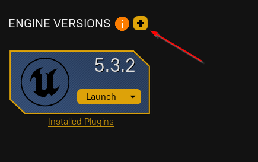

Development Environment Setup Guide
===================================
This section outlines the steps necessary to setup the development
 environment and build the project. 

Setup
-----

1. Download the `Epic Games Launcher <https://www.unrealengine.com/en-US/download>`_.
2. Open the launcher and navigate to the Library tab.
3. If the Unreal Engine version |Engine Version| is not installed, add the version using the button shown below:

Build
-----

.. |Engine Version| replace:: {engine_version}